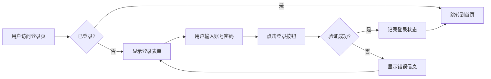

本章节主要介绍使用 jekyll 过程中的常用插件。

# jekyll 插件
+ [mermaid.js](#mermaidjs)
 

## mermaid.js
[官网](https://mermaid.js.org/)、[中文网](https://mermaid.nodejs.cn/intro/)、[github](https://github.com/mermaid-js/mermaid)、[cdn](https://cdn.jsdelivr.net/npm/mermaid/dist/mermaid.min.js)。

在 ``jekyll`` 中使用  ``mermaid.js``，需要安装 ``jekyll-mermaid`` 插件。[官方安装示例](https://rubygems.org/gems/jekyll-mermaid)
1. ``gem install jekyll-mermaid`` 安装插件包（在项目根目录下执行）。
2. 配置 ``_config.yml`` 文件，设置 ``plugins: [jekyll-mermaid]``，当然如果已经有安装的插件直接给数组后面添加即可。 
3. xxx。
4. 最后把新加的插件给 ``Gemfile`` 文件追加``gem 'jekyll-mermaid'`` 配置，方便以后查询。

