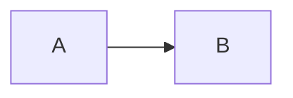
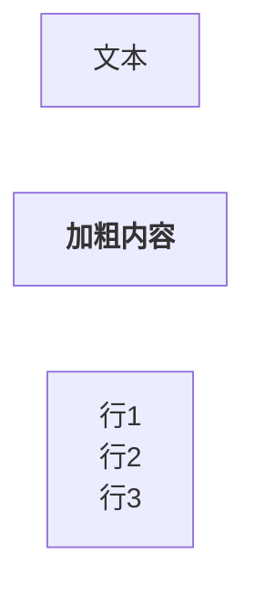
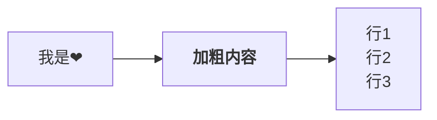
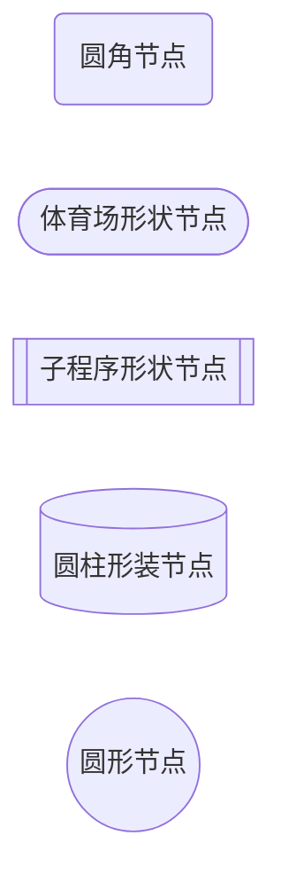

本章节主要介绍使用 markdown 的插件 jekyll 的使用。

# mermaid.js
+ [前言](#前言)
  + [环境配置](#环境配置)
  + [示例](#示例)
+ [流程图](#流程图)


## 前言
``Mermaid`` 是一个基于 ``JavaScript`` 的图表和作图工具，它使用类似 ``Markdown`` 的文本定义和渲染器来创建和修改复杂的图表。``Mermaid`` 的主要目的是帮助文档跟上开发的步伐。
[官网](https://mermaid.js.org/)、[中文网](https://mermaid.nodejs.cn/intro/)、[github](https://github.com/mermaid-js/mermaid)。

### 环境配置
在 ``jekyll`` 中使用  ``mermaid.js``，需要安装 ``jekyll-mermaid`` 插件。[官方安装示例](https://rubygems.org/gems/jekyll-mermaid)，由于[github插件支持白名单](https://docs.github.com/zh/pages/setting-up-a-github-pages-site-with-jekyll/about-github-pages-and-jekyll)中没有 ``jekyll-mermaid`` ，不能通过 ``gem install jekyll-mermaid`` 的方式安装，静态页会不生效，需要通过传统 ``<script>`` 标签的方式引入。

```html
<!-- 将改代码放到 js 代码统一执行的入口处，e.g. 当前静态页放到了 body 的结尾处  -->
<script type="module">
  import mermaid from 'https://cdn.jsdelivr.net/npm/mermaid@11/dist/mermaid.esm.mjs';

  mermaid.initialize({ startOnLoad: true });

  // 由于 markdown 的解析器 kramdown（当前项目使用的解析器，常用的解析器e.g. kramdown、rdiscount、maruku），生成的元素的类名携带了 "language-" 前缀，需要使用 mermaid.run 方法修改元素选择器（高版本已经不支持在 mermaid.initialize 中设置了）
  mermaid.run({ querySelector: '.language-mermaid' });
</script>
```

### 示例
+ 代码块（流程图类型）
````

````
> 输出以上代码块参照 [markdown中展示代码块](/软件/2023/10/08/markdown.html#代码块)

+ 运行结果


### 流程图
流程图由节点（几何形状）和边（箭头或线条）组成。Mermaid 代码定义了节点和边的生成方式，并支持不同类型的箭头、多方向箭头以及与子图的任意链接。

+ 单节点
````

````


> + 使用  ``flowchart``/ ``graph`` 开头，紧跟着是流程图的布局方向。
+ "[文本]" 此内容为非必填，不填写就展示文本 ``id`` 。
+ 如果需要对节点文本使用 ``markdown`` 格式，需要使用  ``""``（双引号）将文本括起来，再使用 `` ` ``（反单引号）号将 ``markdown`` 格式内容括起来。


+ 多节点
````

````


> + 使用 ``-->`` 作为节点连接线串联节点。
+ 布局方向
    + TB - 从上到下
    + TD - 自上而下 / 与从上到下相同
    + BT - 从底部到顶部
    + RL - 从右到左
    + LR - 从左到右


+ 节点形状
````

````


> + 使用 ``-->`` 作为节点连接线串联节点。
+ 布局方向
    + TB - 从上到下
    + TD - 自上而下 / 与从上到下相同
    + BT - 从底部到顶部
    + RL - 从右到左
    + LR - 从左到右

