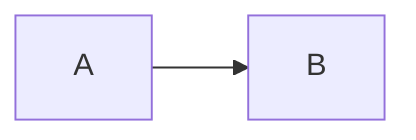
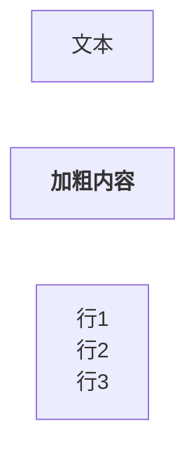
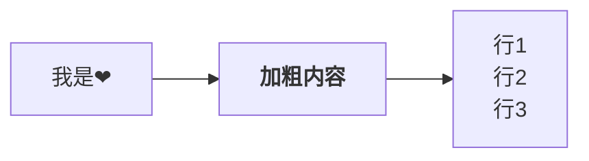
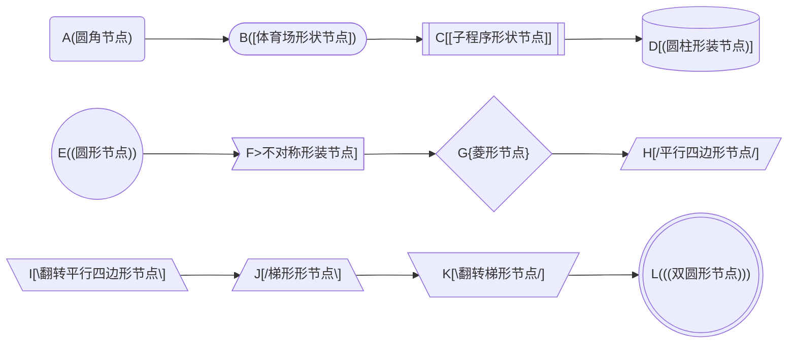
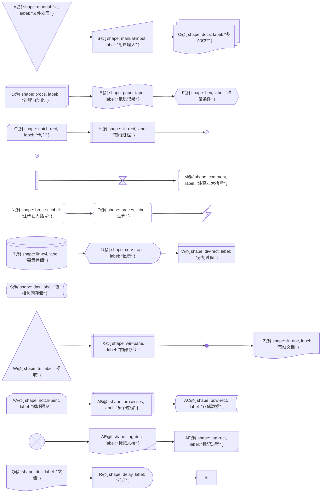
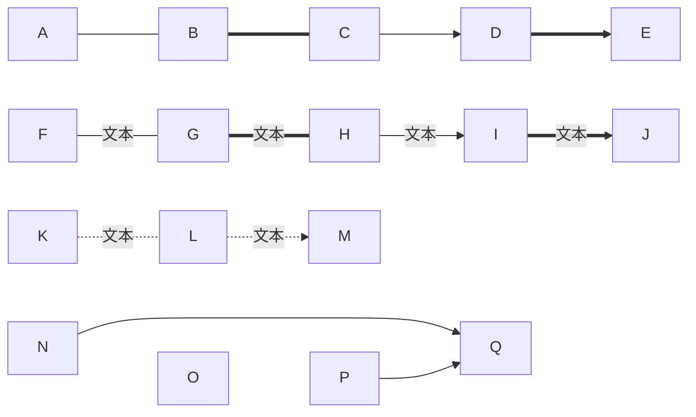

本章节主要介绍使用 markdown 的插件 jekyll 的使用。

# mermaid.js
+ [前言](#前言)
  + [环境配置](#环境配置)
  + [示例](#示例)
+ [流程图](#流程图)
  + [单节点](#单节点)
  + [多节点](#多节点)
  + [节点形状](#节点形状)
  + [连线](#连线)


## 前言
``Mermaid`` 是一个基于 ``JavaScript`` 的图表和作图工具，它使用类似 ``Markdown`` 的文本定义和渲染器来创建和修改复杂的图表。``Mermaid`` 的主要目的是帮助文档跟上开发的步伐。
[官网](https://mermaid.js.org/)、[中文学习网](https://docs.min2k.com/zh/mermaid/intro/)、[github](https://github.com/mermaid-js/mermaid)。

### 环境配置
在 ``jekyll`` 中使用  ``mermaid.js``，需要安装 ``jekyll-mermaid`` 插件。[官方安装示例](https://rubygems.org/gems/jekyll-mermaid)，由于[github插件支持白名单](https://docs.github.com/zh/pages/setting-up-a-github-pages-site-with-jekyll/about-github-pages-and-jekyll)中没有 ``jekyll-mermaid`` ，不能通过 ``gem install jekyll-mermaid`` 的方式安装，静态页会不生效，需要通过传统 ``<script>`` 标签的方式引入。

```html
<!-- 将改代码放到 js 代码统一执行的入口处，e.g. 当前静态页放到了 body 的结尾处  -->
<script type="module">
  import mermaid from 'https://cdn.jsdelivr.net/npm/mermaid@11/dist/mermaid.esm.min.mjs';
  
  // 关闭自动渲染逻辑（依托于 DOMContentLoaded 事件，此时无法修改默认的扫描元素类，需要手动调用 mermaid.run 进行掌控）
  mermaid.initialize({ startOnLoad: false });

  // 由于 markdown 的解析器 kramdown（当前项目使用的解析器，常用的解析器e.g. kramdown、rdiscount、maruku），生成的元素的类名携带了 "language-" 前缀，需要使用 mermaid.run 方法修改元素选择器（高版本已经不支持在 mermaid.initialize 中设置了）
  await mermaid.run({ querySelector: '.language-mermaid' });
  console.log('图表渲染完成...');
</script>
```

### 示例
+ 代码块（流程图类型）
````

````
> 输出以上代码块参照 [markdown中展示代码块](/软件/2023/10/08/markdown.html#代码块)

+ 运行结果


### 流程图
流程图由节点（几何形状）和边（箭头或线条）组成。Mermaid 代码定义了节点和边的生成方式，并支持不同类型的箭头、多方向箭头以及与子图的任意链接。

#### 单节点
````

````


> + 使用  ``flowchart``/ ``graph`` 开头，紧跟着是流程图的布局方向。
+ "[文本]" 此内容为非必填，不填写就展示文本 ``id`` 。
+ 如果需要对节点文本使用 ``markdown`` 格式，需要使用  ``""``（双引号）将文本括起来，再使用 `` ` ``（反单引号）号将 ``markdown`` 格式内容括起来。


#### 多节点
````

````


> + 各个节点之间的 ``id`` 通过使用 ``-->`` 进行节点连接线。
+ 布局方向
    + TB - 从上到下
    + TD - 自上而下 / 与从上到下相同
    + BT - 从底部到顶部
    + RL - 从右到左
    + LR - 从左到右


#### 节点形状
+ 基础节点形状



+ 新节点形状
需要 ``mermaid.js`` 版本 ``v11.3.0+`` 声明方式，e.g.  ``id@{ shape: 形装名称, label: "展示的文本" }`` 。



#### 连线
````
```mermaid
flowchart LR
// 实线 > 粗实线 > 箭头实线 > 箭头粗实线
A --- B === C --> D ==> E

// 文本实线 > 文本粗实线 > 文本箭头实线 > 文本箭头粗实线
F -- 文本 --- G == 文本 === H -- 文本 --> I == 文本 ==> J

// 虚线 > 箭头虚线
K -.- L -.-> M

// 文本虚线 > 文本箭头虚线
K -. 文本 .- L -. 文本 .-> M

// 无形连接（布局使用，强制使得 N O P 不折行）
N ~~~ O ~~~ P
N --> Q
P --> Q
```
````

